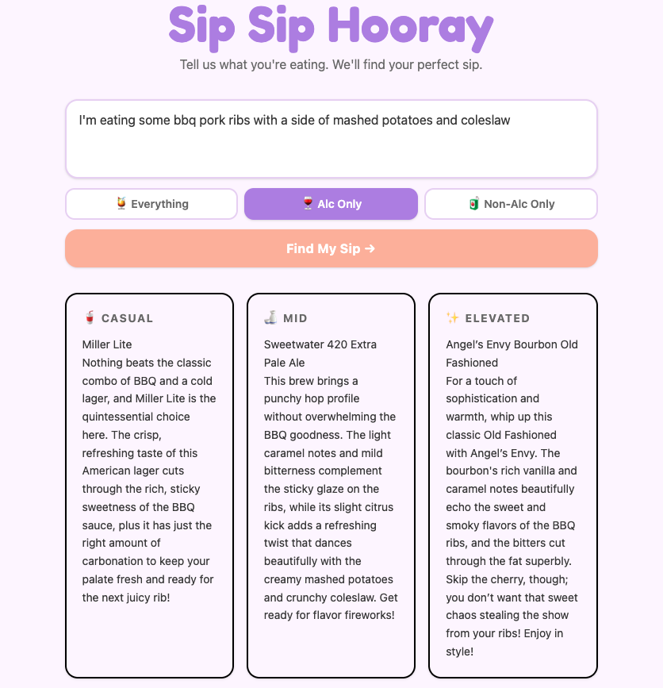

# Sip Sip Hooray 🥂

A drink pairing app powered by RAG and OpenAI. Tell it what you're eating, it tells you what to drink — at three levels of effort, with alc or non-alc options.

**Live:** [sip-sip-hooray.vercel.app](https://sip-sip-hooray.vercel.app)

---



## How it works

1. User describes their meal and sets an alc preference (everything / alc only / non-alc only)
2. The backend embeds the meal description using OpenAI's `text-embedding-3-small` model
3. The embedding is compared against a curated knowledge base of drink pairing principles stored in Supabase with pgvector
4. The most relevant pairings are retrieved via cosine similarity search, filtered by alc preference
5. Retrieved context is passed to `gpt-4o-mini` which streams back three specific recommendations — casual, mid, and elevated — into their own cards in real time

## Tech stack

**Frontend:** React, Tailwind CSS, Vite — deployed on Vercel

**Backend:** Node.js, Express — deployed on Railway

**AI:** OpenAI Embeddings API (`text-embedding-3-small`), OpenAI Chat Completions API (`gpt-4o-mini`) with streaming

**Database:** Supabase with pgvector for vector similarity search

## Knowledge base

The pairing knowledge base is a hand-curated set of 30 entries spanning 10 cuisine types (Thai, Japanese, Italian, Korean, Mexican, Indian, French, Chinese, Mediterranean, BBQ/American), multiple proteins, and flavor profiles (spicy, umami, rich/fatty, smoky, acidic, light, sweet, salty).

Each entry includes a pairing principle, a specific example drink, metadata for filtering, and an alc/non-alc flag. Entries are embedded at ingest time and stored as vectors in Supabase. At query time, the user's meal description is embedded and matched against the knowledge base using cosine similarity.

## Running locally

**Backend:**
```bash
cd server
npm install
# add .env with OPENAI_API_KEY, SUPABASE_URL, SUPABASE_SERVICE_KEY
node index.js
```

**Frontend:**
```bash
cd client
npm install
# add .env.development with VITE_API_URL=http://localhost:3001
npm run dev
```

**Ingest knowledge base:**
```bash
cd server
node ingest.js
```

---

Built by [Jen McPhail](https://linkedin.com/in/jenmcphail) — [github.com/jenmcphail](https://github.com/jenmcphail)